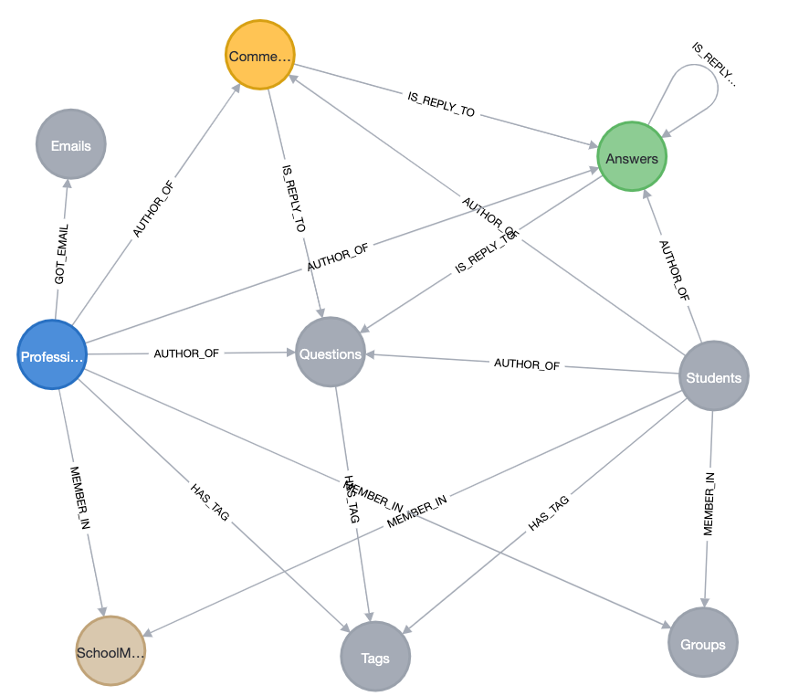

# Python client to intialise the SQL & Neo4j DBMS

The code implemented in this repository is a direct implementation of the research paper: https://dl.acm.org/doi/abs/10.1145/3568562.3568648

## Steps for Neo4j

Prerequisites:
Download the [Kaggle Career Village Dataset](https://www.kaggle.com/competitions/data-science-for-good-careervillage/data) and place all the .csv under a ./dataset directory

Make sure you update the paths of the csv in the `neo4j/load_nodes.py` & `neo4j/create_relationships.py` in the bottom. I have use absolute paths as relative paths don't work in the cypher queries. 

1. Install [Neo4j Desktop](https://neo4j.com/download/)
2. Click on the 3 dots besides the big blue button, and then Settings. Paste the contents of `neo4j.conf` file.
3. Edit the username and password in the .env file
4. Create a database named `sample2`
5. Click the big blue button `Open` which will route you to Neo4j Desktop Client
6. Run the following command in the prompt `:server user add`. Set your Username & Password=and assign the role 'Admin'.
7. Install the dependencies using `pip3 install neo4j/requirements.txt`
8. Just run the initialise_neo4j.sh bash script which will will run the below 2 .py files. 
    a. Runs the `neo4j/load_nodes.py` which will create a node corresponding to each record in the CSV file.
    b. Runs the `neo4j/create_relationships.py` which will create relationships between nodes.

9. Run the following set of queries specified in the queries file and visualise the results visually on Neo4j Desktop Client. 
A fancier way to do it would be drag and drop the cypher query in the `neo4j/cypher_queries` folder one by one onto the Neo4j Desktop Client.

Post completion, a beautiful graph will emerge like the one below...

